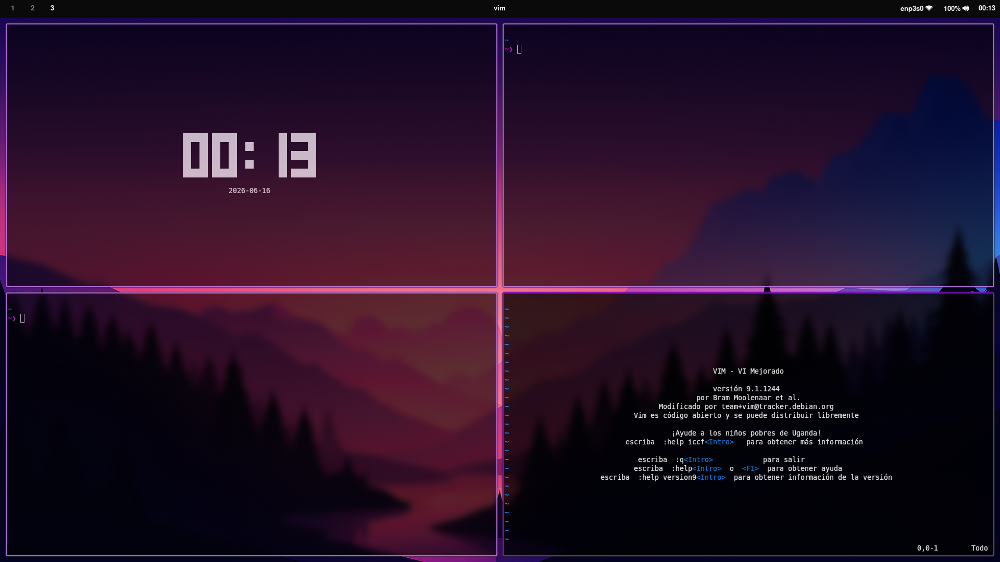
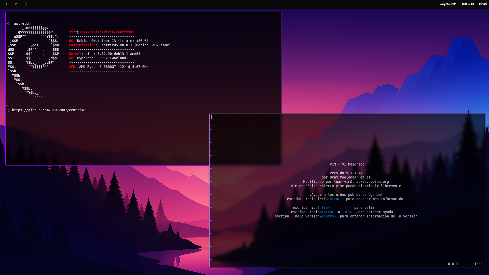

# CentrixOS
Centrix es una capa de personalización creada para sistemas Debian GNU/Linux mediante repositorios oficiales y Debian/Backports.

## Clonado y asignación de permisos
```bash
git clone URL_REPOSITORY

chmod +x centrixOS/pre-install.sh
chmod +x centrixOS/CUSTOMIZATION/install.sh

./centrixOS/pre-install.sh
```

## Versión actual: v0.0.1 (Experimental)
El objetivo es ofrecer una customización con entorno de escritorio Hyprland para sistemas Debian 13 "Trixie" y utilidades del sistema.
El script está en una versión de pruebas aun y no ofrece capas de complejidad. Es un script de Shell bastante simple que instala programas desde los repositorios oficiales y de backports de Debian 13, utilizando la personalización desarrollada por JIRT2007.
Este proyecto se encuentra inspirado en **Omarchy** (Created by: *DHH*) y **Loc-OS** (Created by: *Locos por Linux*). Se agradece a los creadores de los proyectos mencionados y a la comunidad de los sistemas operativos GNU/Linux por la inspiración aportada. 





### Notas importantes:
- CentrixOS no es una distribución de GNU/Linux independiente ni basada en alguna ya existente, es unicamente una capa de personalización.
- Este proyecto aún está en fase de desarrollo por lo que no se recomienda confiar ciegamente en el proceso de instalación, se esta trabajando en las mejoras y correcciones.
- El objetivo principal del mismo es ser una capa de personalización sobre Debian usando paquetería de repositorios oficiales y de Trixie/Backports.
- Se necesita tener configurados los repositorios de Trixie/Backports previo a la ejecución del script.
- NO se debe de ejecutar el script como root ni usando sudo, se recomienda asignarle permisos de ejecución mediante `chmod +x`.
- La customización emplea ***zsh*** como shell del sistema con personalización de ***StarShip***.
- Todas las fallas serán corregidas con el desarrollo de las versiones nuevas.

Muchas gracias por confiar en la capa de personalización de CentrixOS para sistemas Debian GNU/Linux :) .
