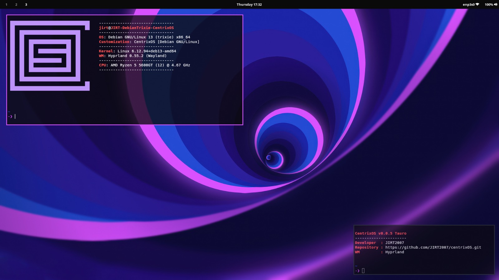
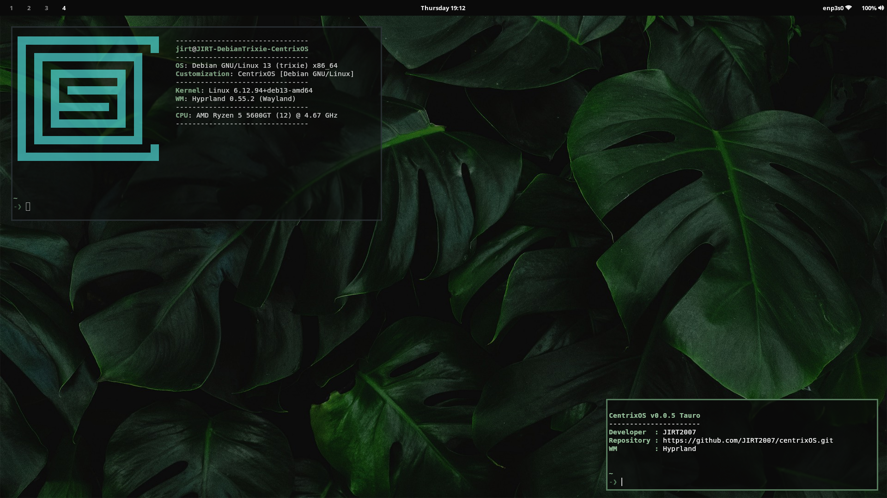
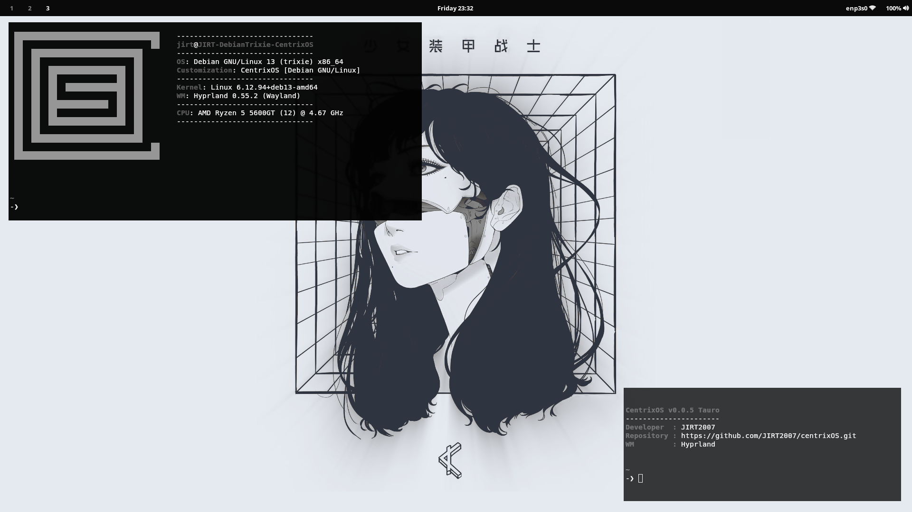

# Bienvenidos a CentrixOS
Centrix es una capa de personalización creada para sistemas Debian GNU/Linux mediante repositorios oficiales y Debian/Backports. https://jirt2007.github.io/webCENTRIX/

## Clonado y asignación de permisos
```bash
git config --global user.name "NAME"
git config --global user.email "user@mail.com"

git clone https://github.com/JIRT2007/centrixOS.git

chmod +x centrixOS/install.sh
./centrixOS/install.sh
```
### KeyBindings basicos para Hyprland: 
```bash
bind = , F1, exec, $terminal
bind = , F2, killactive,
bind = , F3, exec, wofi -a --show drun
```

### Instalar Trixie/Backports (Necesario para Hyprland):
https://backports.debian.org/Instructions/

`sudo vim /etc/apt/sources.list.d/debian-backports.sources`

Contenido: 

```bash
Types: deb deb-src
URIs: http://deb.debian.org/debian
Suites: trixie-backports
Components: main
Enabled: yes
Signed-By: /usr/share/keyrings/debian-archive-keyring.gpg
```
`sudo apt-get update && sudo apt upgrade`

## Sobre el proyecto:
El objetivo es ofrecer una customización con entorno de escritorio Hyprland para sistemas Debian 13 "Trixie" y utilidades del sistema.
El script está en una versión de pruebas aun y no ofrece capas de complejidad. Es un script de Shell bastante simple que instala programas desde los repositorios oficiales y de backports de Debian 13, utilizando la personalización desarrollada por JIRT2007.
Este proyecto se encuentra inspirado en **Omarchy** (Created by: *DHH*) y **Loc-OS** (Created by: *Locos por Linux*). Se agradece a los creadores de los proyectos mencionados y a la comunidad de los sistemas operativos GNU/Linux por la inspiración aportada. 







## Principios filosoficos:

### 1) Simplicidad:
- La instalación de CentrixOS se diseña para ser lo mas simple posible, cada función dentro del script se diseña para ser los mas minimalista posible favoreciendo la modificación y la auditabilidad.

### 2) Personalización:
- CentrixOS ofrece una base de customización sobre Debian GNU/Linux usando Hyprland como entornos de escritorio, los usuarios pueden modificar a su gusto la personalización que se ofrece nativamente.

### 3) Minimalismo:
- CentrixOS instala unicamente los necesario para ofrecer una experiencia de escritorio moderna. El software adicional e innecesario para la customización basica queda a elección del usuario.

### 4) Consistencia:
- Los temas que ofrece el propyecto se componen de diferentes programas se diseñan para compartir una base comun de personalización donde todas las modificaciones coinciden con el resto.

### 5) Sobriedad:
- La interfaz busca ser elegante y funcional antes que llamativa. Cada detalle tiene un motivo de existir y ofrecen al usuario lo minimamente funcional posible sin renunciar a una capa de customización moderna. 

### Recomendaciones:
- No ejecute el comando de la forma `sudo ./centrixOS/install.sh`, es preferible asignarle previamente permisos de ejecución.
- Se recomienda previo a la instalación sobre hardware fisico, realizar una instalación y pruebas sobre una Virtual Machine.
- Luego de instalada la capa de personalización se recomienda reiniciar el equipo.
- Se recomienda realizar la instalacion de CentrixOS sobre un sistema Debian GNU/Linux recien instalado.

